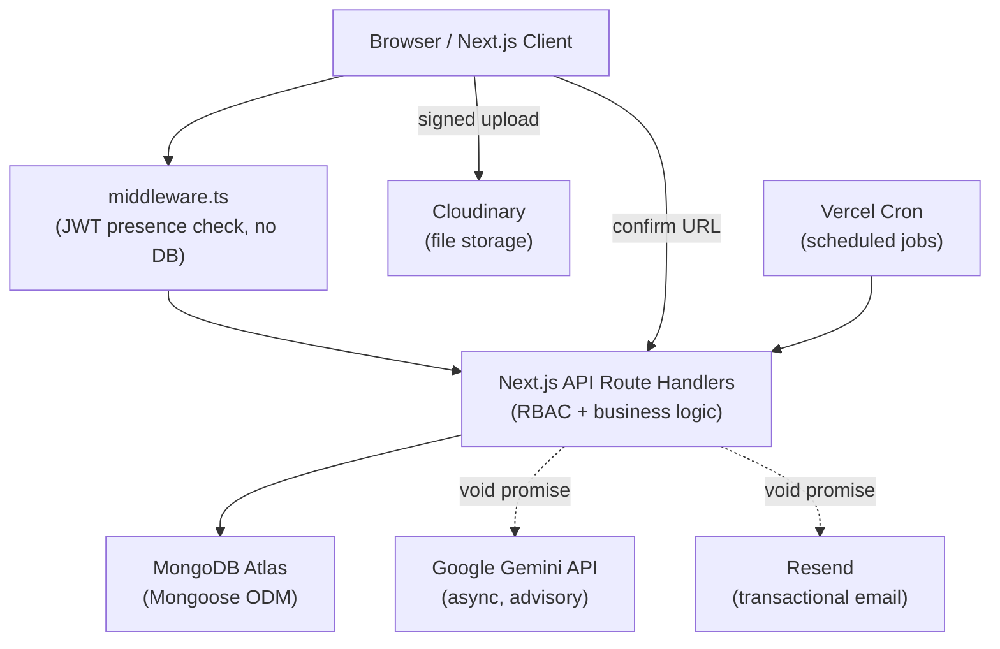
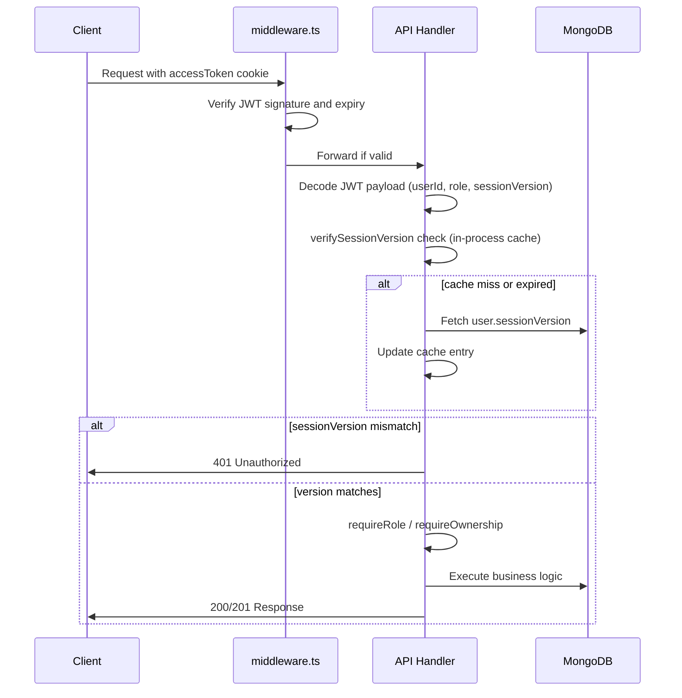
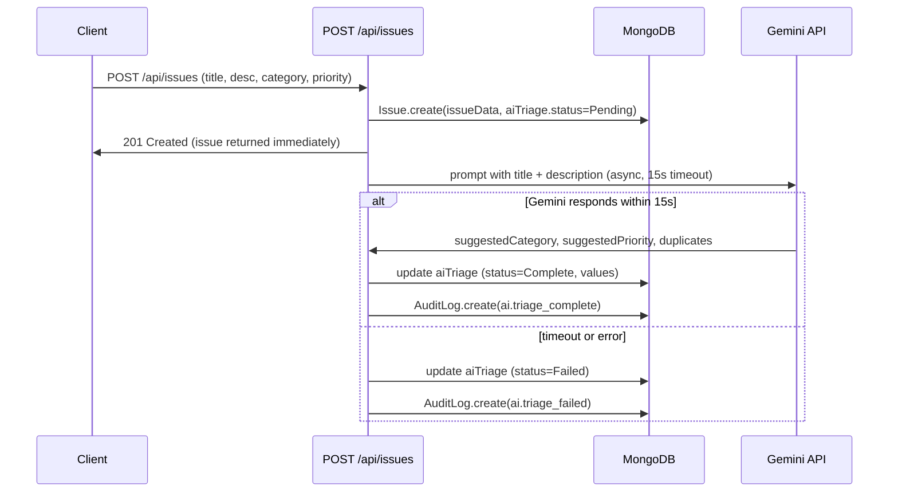
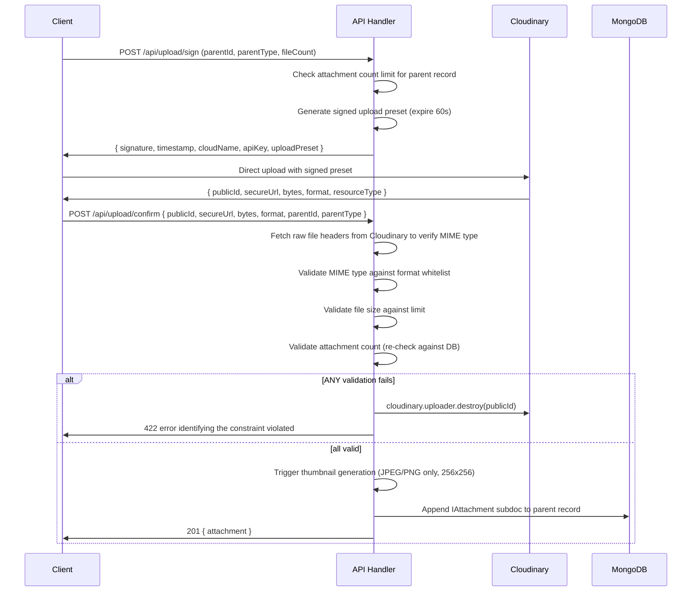
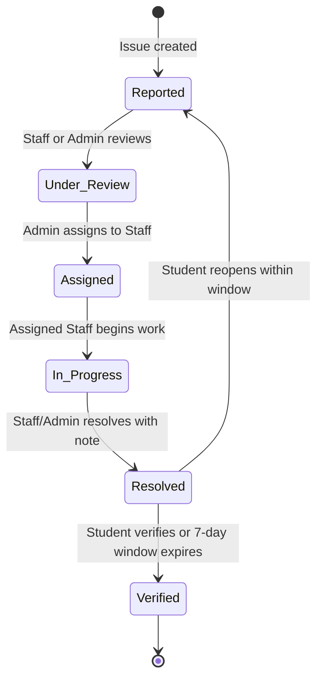

# CampusConnect — Technical Design Document

---

## Overview

CampusConnect is a full-stack web platform for campus issue reporting and Lost & Found item management. Students, staff, and administrators submit, track, and resolve maintenance or safety issues, and post or claim lost and found items. AI-assisted triage and duplicate detection are advisory and non-blocking. Role-based access control enforces permissions at every API layer.

### Stack Summary

| Concern | Technology |
|---|---|
| Framework | Next.js 14+ App Router, TypeScript |
| Database | MongoDB Atlas (free tier) + Mongoose ODM |
| Authentication | JWT (1 h) in httpOnly cookie + Refresh Token (7 d) in httpOnly cookie, bcrypt cost 12 |
| AI | Google Gemini API (free tier) — advisory suggestions only, non-blocking |
| File Storage | Cloudinary free tier — client direct upload with signed preset |
| Email | Resend free tier — transactional email for important events only |
| Styling | Tailwind CSS |
| Deployment | Vercel free tier, Node.js runtime (NOT Edge) on all API routes |

### Design Goals

1. **Correctness first** — every state transition, permission check, and validation rule maps directly to a requirement clause.
2. **Non-blocking async side-effects** — AI triage, notifications, and email are fired with `void promise` after the primary DB write; they never delay the HTTP response.
3. **No over-engineering** — no Redis, no SSE endpoints, no background job queues. Scheduled tasks run via Vercel Cron. In-process maps handle short-lived caching.
4. **Role enforcement is server-side only** — the UI hides controls for clarity, but every API route independently verifies role and ownership.
5. **Secure by default** — parameterised queries, MIME-header validation, CSP, and rate limiting are applied unconditionally.

---

## Architecture



All API route handlers run in the Node.js runtime. The middleware only checks JWT presence and basic validity — it performs no database calls.

---

## Components and Interfaces

### Component Responsibilities

| Component | Responsibility |
|---|---|
| `middleware.ts` | Parse the `accessToken` cookie; verify JWT signature and expiry; redirect unauthenticated requests to `/login`. No DB access. |
| API Route Handlers | Parse request bodies; call `requireRole()` / `requireOwnership()`; execute business logic; write to DB; fire async side-effects. |
| `requireRole(role, handler)` | Decorator/helper that extracts the JWT payload and checks `payload.role` before invoking the handler. Returns 403 if the role is insufficient. |
| `requireOwnership(userId, resourceOwnerId)` | Utility that compares the requesting user's ID with the resource owner's ID. Returns 403 if they do not match, unless the requester is an Administrator. |
| `verifySessionVersion(userId, tokenVersion)` | Checks the in-process session cache (30 s TTL) then falls back to a MongoDB lookup. Returns 401 if the token's `sessionVersion` does not match the stored value. |
| `AI_Suggestion_Service` | Sends Gemini prompts asynchronously after primary DB write. Updates the Issue or LostFoundItem `aiTriage` field. Never blocks the HTTP response. |
| `Media_Service` | Generates a signed Cloudinary upload preset, receives upload confirmation, validates MIME headers, enforces size/count limits, triggers thumbnail generation, calls `cloudinary.uploader.destroy` on rejection. |
| `Email_Service` | Sends transactional emails via the Resend SDK for the 5 permitted email event types. Retries up to 3 times on failure; logs failures to the application log. |
| `Notification_Service` | Persists in-app Notification documents to MongoDB within 5 seconds of the triggering event. |
| `Search_Service` | Executes MongoDB `$text` queries with cursor-based pagination on Issues and LostFoundItems. |
| `Audit_Service` | Writes append-only AuditLog documents. Exposed only to Administrators for read access. |
| Vercel Cron Jobs | Fire `POST /api/cron/verification-window` and `POST /api/cron/archive-lf-items` on schedule. |

### Request Flow

1. Browser sends a request with the `accessToken` httpOnly cookie.
2. `middleware.ts` validates JWT signature and expiry. If invalid or absent, redirects to `/login`. Does **not** read from MongoDB.
3. The matching API route handler fires. It calls `verifySessionVersion(userId, tokenSessionVersion)` — one Map lookup, DB fetch only on cache miss.
4. The handler calls `requireRole()` or `requireOwnership()` as appropriate.
5. The handler validates the request body with a Zod schema.
6. The primary DB operation executes.
7. The HTTP response is sent (201/200/etc.).
8. Async side-effects fire with `void promise` — AI triage, notifications, email.

> **Why not DB in middleware?**
> Vercel runs `middleware.ts` on the Edge runtime, which cannot use the Node.js MongoDB driver. Keeping the middleware to a pure JWT check avoids this constraint, keeps cold-start times low, and means the DB is only accessed in Node.js API route handlers where the full Mongoose ODM is available.

---

## Authentication & RBAC Design

### JWT Flow



### JWT Payload Interface

```typescript
interface JWTPayload {
  sub: string;           // MongoDB user _id (string)
  role: 'Student' | 'Staff' | 'Administrator';
  sessionVersion: number;
  iat: number;
  exp: number;           // iat + 3600 (1 hour)
}
```

### Session Invalidation via sessionVersion

When an Administrator changes a user's role, `user.sessionVersion` is incremented atomically in MongoDB. The user's existing JWT still carries the old `sessionVersion` value. To enforce invalidation without incurring a DB round-trip on every single request, the server maintains an in-process cache.

```typescript
// lib/sessionCache.ts
interface CacheEntry {
  sessionVersion: number;
  cachedAt: number; // Date.now()
}

const SESSION_CACHE_TTL_MS = 5_000; // 5 seconds -- satisfies the 5-second invalidation window in Req 2.7
const cache = new Map<string, CacheEntry>();

export async function verifySessionVersion(
  userId: string,
  tokenSessionVersion: number
): Promise<boolean> {
  const now = Date.now();
  const entry = cache.get(userId);

  let dbVersion: number;

  if (entry && now - entry.cachedAt < SESSION_CACHE_TTL_MS) {
    dbVersion = entry.sessionVersion;
  } else {
    const user = await User.findById(userId).select('sessionVersion').lean();
    if (!user) return false;
    dbVersion = user.sessionVersion;
    cache.set(userId, { sessionVersion: dbVersion, cachedAt: now });
  }

  if (tokenSessionVersion !== dbVersion) {
    cache.delete(userId); // clear stale entry
    return false;
  }
  return true;
}
```

**Every authenticated API handler** calls `verifySessionVersion` immediately after extracting the JWT payload. The overhead per request is one `Map.get` lookup. A DB fetch occurs only on a cache miss or when the 5-second TTL expires. This means role-change invalidation takes effect within at most 5 seconds of the change, directly satisfying the requirement in Req 2.7. There is no "30-second default with a note to tighten later" -- the 5-second TTL is the implemented default.

There is no phrase "For most endpoints this extra DB call is skipped" — `verifySessionVersion` is called on **all** authenticated endpoints.

### RBAC Helpers

```typescript
// lib/rbac.ts
import { NextRequest, NextResponse } from 'next/server';

type Role = 'Student' | 'Staff' | 'Administrator';

export function requireRole(
  minRole: Role,
  handler: (req: NextRequest, payload: JWTPayload) => Promise<NextResponse>
) {
  const ROLE_RANK: Record<Role, number> = {
    Student: 1,
    Staff: 2,
    Administrator: 3,
  };
  return async (req: NextRequest) => {
    const payload = extractJWT(req); // throws if missing/invalid
    if (!payload) return NextResponse.json({ error: 'Unauthorized' }, { status: 401 });

    const valid = await verifySessionVersion(payload.sub, payload.sessionVersion);
    if (!valid) return NextResponse.json({ error: 'Session invalidated' }, { status: 401 });

    if (ROLE_RANK[payload.role] < ROLE_RANK[minRole]) {
      await auditRbacViolation(payload, req);
      return NextResponse.json({ error: 'Forbidden' }, { status: 403 });
    }
    return handler(req, payload);
  };
}

export function requireOwnership(
  requesterId: string,
  ownerId: string,
  role: Role
): boolean {
  if (role === 'Administrator') return true;
  return requesterId === ownerId;
}
```

### middleware.ts

```typescript
// middleware.ts
import { NextRequest, NextResponse } from 'next/server';
import { jwtVerify } from 'jose';

const PUBLIC_PATHS = ['/login', '/register', '/api/auth/login', '/api/auth/register', '/api/auth/refresh'];

export async function middleware(req: NextRequest) {
  const { pathname } = req.nextUrl;
  if (PUBLIC_PATHS.some((p) => pathname.startsWith(p))) return NextResponse.next();

  const token = req.cookies.get('accessToken')?.value;
  if (!token) return NextResponse.redirect(new URL('/login', req.url));

  try {
    await jwtVerify(token, new TextEncoder().encode(process.env.JWT_SECRET!));
    return NextResponse.next();
  } catch {
    return NextResponse.redirect(new URL('/login', req.url));
  }
}

export const config = { matcher: ['/((?!_next/static|_next/image|favicon.ico).*)'] };
```

### Refresh Token Storage

The refresh token (7-day expiry) is stored as a field on the User document in MongoDB (hashed with bcrypt). It is delivered to the client as an httpOnly, Secure, SameSite=Strict cookie named `refreshToken`. On every use it is rotated — the old hash is invalidated and a new token is issued.

---

## Data Models

### IAttachment Subdocument

```typescript
interface IAttachment {
  url: string;           // Cloudinary HTTPS URL
  publicId: string;      // Cloudinary public_id for deletion
  mimeType: string;      // verified from file headers
  sizeBytes: number;
  thumbnailUrl?: string; // 256x256 JPEG, generated within 10 s
  uploadedAt: Date;
}
```

### User

```typescript
interface IUser {
  _id: ObjectId;
  email: string;              // unique, lowercase, campus email
  passwordHash: string;       // bcrypt cost 12
  role: 'Student' | 'Staff' | 'Administrator';
  status: 'Active' | 'PendingApproval' | 'Deactivated';
  sessionVersion: number;     // incremented on role change
  displayName: string;
  campusId: string;
  department?: string;
  phone?: string;
  refreshTokenHash?: string;  // bcrypt hash of current refresh token
  failedLoginAttempts: number;
  lockUntil?: Date;
  emailPreferences: {
    issueStatusChange: boolean;  // covers issue_status_change
    claimUpdate: boolean;        // covers claim_approved + claim_rejected
    staffAssignment: boolean;    // covers issue_assigned
    criticalIssue: boolean;      // covers issue_critical
  };
  createdAt: Date;
  updatedAt: Date;
}
```

**Indexes:** `{ email: 1 }` unique; `{ role: 1, status: 1 }`.

### Issue

```typescript
type IssueStatus = 'Reported' | 'Under_Review' | 'Assigned' | 'In_Progress' | 'Resolved' | 'Verified';
type Priority = 'Low' | 'Medium' | 'High' | 'Critical';

interface IIssue {
  _id: ObjectId;
  title: string;              // 5-120 chars
  description: string;        // 20-2000 chars
  category: string;
  location: string;           // 3-200 chars
  priority: Priority;
  status: IssueStatus;
  submittedBy: ObjectId;      // ref User
  assignedTo?: ObjectId;      // ref User (Staff)
  attachments: IAttachment[];
  resolutionNote?: string;    // 20-1000 chars, required on -> Resolved
  resolutionPhotos: IAttachment[];
  verificationWindowEnd?: Date; // set when status -> Resolved
  aiTriage: {
    status: 'Pending' | 'Complete' | 'Failed';
    suggestedCategory?: string;
    suggestedPriority?: Priority;
    potentialDuplicates: Array<{
      issueId: ObjectId;
      similarityScore: number;
      dismissed: boolean;
    }>;
    invokedAt?: Date;
  };
  statusHistory: Array<{
    from: IssueStatus;
    to: IssueStatus;
    changedBy: string;  // userId or 'system'
    changedAt: Date;
  }>;
  createdAt: Date;
  updatedAt: Date;
}
```

**Indexes:** `{ status: 1, priority: -1, createdAt: -1 }`; `{ submittedBy: 1 }`; `{ assignedTo: 1 }`; `{ $text: { title, description } }` (for search); `{ 'aiTriage.potentialDuplicates.issueId': 1 }`.

### LostFoundItem

```typescript
type LFStatus = 'Active' | 'Claimed' | 'Archived';
type LFType = 'Lost' | 'Found';

interface ILostFoundItem {
  _id: ObjectId;
  type: LFType;
  title: string;              // 5-100 chars
  description: string;        // 10-1000 chars
  category: string;
  location: string;           // 1-200 chars
  itemDate: Date;             // not in the future
  status: LFStatus;
  postedBy: ObjectId;         // ref User
  attachments: IAttachment[];
  aiTriage: {
    status: 'Pending' | 'Complete' | 'Failed';
    candidateMatches: Array<{
      itemId: ObjectId;
      confidenceScore: number;
      dismissed: boolean;
    }>;
    invokedAt?: Date;
  };
  createdAt: Date;
  updatedAt: Date;
}
```

**Indexes:** `{ type: 1, status: 1, createdAt: -1 }`; `{ postedBy: 1 }`; `{ $text: { title, description } }`.

### Claim

```typescript
type ClaimStatus = 'Pending' | 'Approved' | 'Rejected' | 'Archived';

interface IClaim {
  _id: ObjectId;
  foundItemId: ObjectId;      // ref LostFoundItem (Found type only)
  claimedBy: ObjectId;        // ref User
  ownershipEvidence: string;  // 30-1000 chars
  status: ClaimStatus;
  rejectionReason?: string;   // up to 500 chars, set on rejection
  createdAt: Date;
  updatedAt: Date;
}
```

**Indexes:** `{ foundItemId: 1, claimedBy: 1 }` unique partial index on `{ status: { $in: ['Pending', 'Approved'] } }`; `{ foundItemId: 1, status: 1 }`.

### Comment

```typescript
type ParentType = 'Issue' | 'LostFoundItem';

interface IComment {
  _id: ObjectId;
  parentId: ObjectId;
  parentType: ParentType;
  authorId: ObjectId;
  body: string;               // 1-1000 chars
  deletedAt?: Date;           // set on tombstone; body replaced with '[deleted]'
  editedAt?: Date;
  createdAt: Date;
  updatedAt: Date;
}
```

**Indexes:** `{ parentId: 1, parentType: 1, createdAt: 1 }`.

### Notification

```typescript
interface INotification {
  _id: ObjectId;
  userId: ObjectId;
  eventType: string;
  message: string;
  linkPath?: string;           // relative URL for deep-link
  read: boolean;
  createdAt: Date;             // TTL index: auto-delete after 90 days
}
```

**Indexes:** `{ userId: 1, read: 1, createdAt: -1 }`; TTL index `{ createdAt: 1 }` with `expireAfterSeconds: 7776000` (90 days).

### AuditLog

```typescript
interface IAuditLog {
  _id: ObjectId;
  actorId: string;             // userId or 'system'
  actionType: string;          // e.g. 'issue.status_change'
  entityType: string;
  entityId: string;
  changedValues?: Record<string, unknown>;
  metadata?: Record<string, unknown>;
  createdAt: Date;
}
```

**Indexes:** `{ actorId: 1, createdAt: -1 }`; `{ entityType: 1, entityId: 1 }`; `{ actionType: 1 }`; TTL index `{ createdAt: 1 }` with `expireAfterSeconds: 7776000` (90 days minimum; operator may extend).

No user or process may update or delete AuditLog documents. The Mongoose model omits `update` and `delete` hooks, and the API layer has no routes that modify AuditLog entries.

---

## API Design

### Auth — `/api/auth`

| Method | Path | Auth | Description |
|---|---|---|---|
| POST | `/api/auth/register` | None | Validate and create user; email confirmation |
| POST | `/api/auth/login` | None | Verify credentials; issue JWT + refresh token cookies |
| POST | `/api/auth/refresh` | refreshToken cookie | Rotate refresh token; issue new JWT |
| POST | `/api/auth/logout` | Any authenticated | Clear both httpOnly cookies |
| POST | `/api/auth/password-reset/request` | None | Generate single-use reset token; email link |
| POST | `/api/auth/password-reset/confirm` | None | Validate token; update password hash |

### Users — `/api/users`

| Method | Path | Auth | Description |
|---|---|---|---|
| GET | `/api/users/me` | Any authenticated | Return own profile |
| PATCH | `/api/users/me` | Any authenticated | Update own display name, phone, department |
| GET | `/api/users` | Administrator | List all users with pagination |
| PATCH | `/api/users/:id/role` | Administrator | Change user role; increment `sessionVersion` |
| PATCH | `/api/users/:id/status` | Administrator | Activate / deactivate user |
| DELETE | `/api/users/:id` | Administrator | Pseudonymise and deactivate user |
| POST | `/api/users/:id/approve` | Administrator | Approve pending Administrator registration |
| POST | `/api/users/:id/reject` | Administrator | Reject pending Administrator registration |

### Issues — `/api/issues`

| Method | Path | Auth | Description |
|---|---|---|---|
| GET | `/api/issues` | Any authenticated | List / search issues (uses Search_Service) |
| POST | `/api/issues` | Any authenticated | Create issue; fire AI triage async |
| GET | `/api/issues/:id` | Any authenticated | Get issue detail including `aiTriage` data |
| PATCH | `/api/issues/:id` | Submitter or Admin | Edit title, description, category, location, priority |
| DELETE | `/api/issues/:id` | Submitter or Admin | Delete issue |
| POST | `/api/issues/:id/status` | Staff (own dept) or Admin | Transition status; enforce valid transitions |
| POST | `/api/issues/:id/assign` | Administrator | Assign issue to a Staff user |
| POST | `/api/issues/:id/duplicate/dismiss` | Administrator | Dismiss a potential duplicate link |
| POST | `/api/issues/:id/duplicate/merge` | Administrator | Merge duplicate; transfer comments and attachments |

### Lost & Found Items — `/api/lf-items`

| Method | Path | Auth | Description |
|---|---|---|---|
| GET | `/api/lf-items` | Any authenticated | List / search L&F items |
| POST | `/api/lf-items` | Any authenticated | Create Lost or Found item; fire AI match async |
| GET | `/api/lf-items/:id` | Any authenticated | Get item detail including `aiTriage` data |
| PATCH | `/api/lf-items/:id` | Poster or Admin | Edit item |
| DELETE | `/api/lf-items/:id` | Poster or Admin | Delete item |

### Claims — `/api/lf-items/:id/claims`

| Method | Path | Auth | Description |
|---|---|---|---|
| POST | `/api/lf-items/:id/claims` | Any authenticated (not the item poster) | Submit claim with ownership evidence |
| GET | `/api/lf-items/:id/claims` | Item poster or Admin | List claims for a Found item |
| POST | `/api/lf-items/:id/claims/:claimId/approve` | Item poster | Approve claim; transition item to Claimed |
| POST | `/api/lf-items/:id/claims/:claimId/reject` | Item poster | Reject claim with reason |

Any authenticated user — Student, Staff, or Administrator — may submit a Claim against a Found_Item, provided they are **not** the poster of that Found_Item. The `POST /api/lf-items/:id/claims` handler checks: if `foundItem.postedBy.toString() === requesterId`, it returns 409 with the message "You cannot claim your own found item posting."

### Comments — `/api/comments`

| Method | Path | Auth | Description |
|---|---|---|---|
| GET | `/api/comments?parentId=&parentType=` | Any authenticated | List comments for a parent record |
| POST | `/api/comments` | Any authenticated | Post a comment |
| PATCH | `/api/comments/:id` | Comment author (within 15 min) | Edit comment body |
| DELETE | `/api/comments/:id` | Comment author or Admin | Tombstone comment |

### File Uploads — `/api/upload`

| Method | Path | Auth | Description |
|---|---|---|---|
| POST | `/api/upload/sign` | Any authenticated | Generate a signed Cloudinary upload preset |
| POST | `/api/upload/confirm` | Any authenticated | Validate uploaded file; attach to parent record; destroy on failure |

### Notifications — `/api/notifications`

| Method | Path | Auth | Description |
|---|---|---|---|
| GET | `/api/notifications` | Any authenticated | Paginated list of own notifications |
| POST | `/api/notifications/:id/read` | Owner | Mark one notification as read |
| POST | `/api/notifications/read-all` | Any authenticated | Mark all unread as read |

### Audit Log — `/api/audit`

| Method | Path | Auth | Description |
|---|---|---|---|
| GET | `/api/audit` | Administrator | Query audit log with filters and pagination (50 per page) |

### Dashboards — `/api/dashboard`

| Method | Path | Auth | Description |
|---|---|---|---|
| GET | `/api/dashboard/student` | Student | Own issues, L&F items, unread notifications |
| GET | `/api/dashboard/staff` | Staff | Assigned issues, dept open issues, recent activity |
| GET | `/api/dashboard/admin` | Administrator | Platform-wide stats, pending claims count, staff workload |

### System / Cron — `/api/cron`

| Method | Path | Auth | Description |
|---|---|---|---|
| POST | `/api/cron/verification-window` | Cron secret header | Auto-verify resolved issues past 7-day window |
| POST | `/api/cron/archive-lf-items` | Cron secret header | Archive L&F items past 90-day threshold |
| POST | `/api/cron/stale-issue-reminder` | Cron secret header | Send reminder notifications for issues in Reported > 72 h |
| GET | `/api/health` | None | Health check: DB + Cloudinary status |

---

## AI Integration Design

### Design Principles

- **Non-blocking** — AI calls never hold up the HTTP response. The primary DB write completes and the response is returned, then AI runs asynchronously.
- **Advisory only** — suggestions are stored in the `aiTriage` field and displayed to the user. They do not trigger automatic merges, category overrides, or ownership decisions.
- **Graceful degradation** — if Gemini does not respond within 15 seconds or returns an error, the submission is valid and complete. `aiTriage.status` is set to `'Failed'` and the issue proceeds with the user-supplied values.
- **Post-submission display** — AI suggestions appear on the detail page after the item is persisted, not before. There is no pre-submission confirmation modal.

### Async Non-Blocking Pattern

```typescript
// In POST /api/issues handler, after DB write and 201 response:
async function runIssueTriage(issueId: string): Promise<void> {
  try {
    const result = await Promise.race([
      callGeminiIssueTriage(issueId),
      new Promise<never>((_, reject) =>
        setTimeout(() => reject(new Error('timeout')), 15_000)
      ),
    ]);
    await Issue.findByIdAndUpdate(issueId, {
      'aiTriage.status': 'Complete',
      'aiTriage.suggestedCategory': result.category,
      'aiTriage.suggestedPriority': result.priority,
      'aiTriage.potentialDuplicates': result.duplicates,
      'aiTriage.invokedAt': new Date(),
    });
    await auditLog('ai.triage_complete', 'Issue', issueId, { result });
  } catch {
    await Issue.findByIdAndUpdate(issueId, {
      'aiTriage.status': 'Failed',
      'aiTriage.invokedAt': new Date(),
    });
    await auditLog('ai.triage_failed', 'Issue', issueId, {});
  }
}

// Fired with void — does NOT await
export async function POST(req: NextRequest) {
  // ... validation, DB write ...
  const issue = await Issue.create(issueData);
  void runIssueTriage(issue._id.toString()); // fire and forget
  return NextResponse.json(issue, { status: 201 });
}
```

### Issue Triage Sequence



### Gemini Prompt — Issue Triage

```
You are an AI assistant helping a campus facilities management system triage maintenance issues.

Given the following issue submission:
Title: {title}
Description: {description}

Existing categories: {categoriesList}

Return a JSON object with:
{
  "suggestedCategory": "<one of the existing categories>",
  "suggestedPriority": "<Low|Medium|High|Critical>",
  "rationale": "<one sentence explaining the priority choice>"
}

Rules:
- Critical priority is for immediate safety hazards only.
- High priority is for issues that significantly impair daily operations.
- Medium is the default for inconvenient but non-urgent issues.
- Low is for cosmetic or minor quality-of-life issues.
```

### Gemini Prompt — L&F Matching

```
You are an AI assistant helping match lost and found items on a campus platform.

A user has posted a {type} item:
Title: {title}
Description: {description}
Category: {category}
Location: {location}
Date: {date}

Here are up to 20 Active {oppositeType} items from the database (JSON array):
{candidatesJson}

Return a JSON array of up to 5 best matches, ranked by confidence, in this format:
[
  { "itemId": "<MongoDB _id>", "confidenceScore": <0.0 to 1.0>, "rationale": "<one sentence>" }
]

Return an empty array if no reasonable matches exist. Do not invent item IDs.
```

### Timeout and Error Handling

If Gemini does not return a response within 15 seconds or returns a non-2xx status:
- The promise race resolves with a timeout error.
- `aiTriage.status` is set to `'Failed'`.
- The issue or L&F item is already persisted with `aiTriage.status = 'Pending'` and remains fully usable.
- An AuditLog entry records the failure.
- The client-side detail page displays "AI suggestions unavailable" when `aiTriage.status === 'Failed'`.

### Post-Submission Display Rule (High-Confidence Suggestions)

AI suggestions are **never** displayed before or during submission. There is no pre-submission modal.

After the issue or L&F item is persisted, the detail page polls `GET /api/issues/:id` (or `GET /api/lf-items/:id`) periodically. Once `aiTriage.status === 'Complete'`:

- **Issues:** If `potentialDuplicates` contains any entry with `similarityScore >= 0.85` and `dismissed === false`, the issue detail page renders a `DuplicateSuggestionBanner` showing the candidates. The user can dismiss the suggestion (setting `dismissed = true`). An Administrator can confirm a duplicate relationship via the merge flow.
- **L&F Items:** If `candidateMatches` contains any entry with `confidenceScore >= 0.80` and `dismissed === false`, the L&F item detail page renders an `AIMatchSuggestion` component showing the candidates. The user can dismiss them. No automatic linking or ownership transfer occurs.

---

## File Upload Design

### Upload Flow



### MIME Validation

```typescript
import { fromBuffer } from 'file-type';

async function verifyMime(cloudinaryPublicId: string): Promise<string> {
  // Fetch raw bytes from Cloudinary (first 4096 bytes sufficient for magic bytes)
  const res = await fetch(`https://res.cloudinary.com/${cloudName}/image/upload/${cloudinaryPublicId}`);
  const buffer = Buffer.from(await res.arrayBuffer()).slice(0, 4096);
  const detected = await fromBuffer(buffer);
  return detected?.mime ?? 'application/octet-stream';
}
```

The client-supplied `Content-Type` header is never trusted for format enforcement. MIME type is always determined from the file's magic bytes after download from Cloudinary.

### Format and Size Limits

| Context | Accepted Formats | Max Size | Max Count |
|---|---|---|---|
| Issue Attachments | JPEG, PNG, PDF, MP4 | 10 MB each | 5 per issue |
| L&F Item Attachments | JPEG, PNG | 10 MB each | 5 per item |
| Resolution Photos | JPEG, PNG | 5 MB each | 3 per issue |

### Thumbnails

For every JPEG or PNG file successfully attached, the API enqueues a thumbnail generation call to Cloudinary's transformation API (eager transformation: `c_fill,w_256,h_256,f_jpg`). The `thumbnailUrl` is stored on the `IAttachment` subdocument once Cloudinary confirms generation. This must complete within 10 seconds of the upload confirmation.

---

## Issue Lifecycle State Machine

### Status Diagram



### Transition Authority Matrix

| Transition | Who May Trigger |
|---|---|
| Reported -> Under_Review | Staff (own dept), Administrator |
| Under_Review -> Assigned | Administrator |
| Assigned -> In_Progress | Assigned Staff, Administrator |
| In_Progress -> Resolved | Assigned Staff, Administrator (requires Resolution_Note) |
| Resolved -> Verified | Original submitting Student, System (cron after 7 days) |
| Resolved -> Reported | Original submitting Student only (within Verification_Window) |

Any transition not listed above is rejected with a 422 response. The `POST /api/issues/:id/status` handler enforces this table server-side. The Under_Review -> In_Progress shortcut is **not** a valid transition and is rejected.

### Resolution Requirements

When transitioning to `Resolved`:
- A `resolutionNote` of 20–1000 characters is required. The transition is rejected if absent.
- Up to 3 `resolutionPhotos` (JPEG or PNG, max 5 MB each) may be optionally attached.
- If a photo fails validation, only that photo is rejected; the transition proceeds with the valid photos.
- `verificationWindowEnd` is set to `now + 7 days`.
- An in-app and email notification is sent to the submitting Student.

### Verification Window Cron Job

```typescript
// app/api/cron/verification-window/route.ts
export async function POST(req: NextRequest) {
  const secret = req.headers.get('x-cron-secret');
  if (secret !== process.env.CRON_SECRET) {
    return NextResponse.json({ error: 'Forbidden' }, { status: 403 });
  }

  const now = new Date();
  const expired = await Issue.find({
    status: 'Resolved',
    verificationWindowEnd: { $lte: now },
  }).select('_id submittedBy');

  for (const issue of expired) {
    await Issue.findByIdAndUpdate(issue._id, {
      status: 'Verified',
      $push: {
        statusHistory: {
          from: 'Resolved',
          to: 'Verified',
          changedBy: 'system',
          changedAt: now,
        },
      },
    });
    await auditLog('issue.status_change', 'Issue', issue._id.toString(), {
      from: 'Resolved',
      to: 'Verified',
      changedBy: 'system',
    });
    void sendNotification(issue.submittedBy.toString(), 'issue_status_change', {
      issueId: issue._id.toString(),
      newStatus: 'Verified',
    });
  }

  return NextResponse.json({ processed: expired.length });
}
```

**vercel.json schedule:**

```json
{
  "crons": [
    { "path": "/api/cron/verification-window", "schedule": "0 * * * *" },
    { "path": "/api/cron/archive-lf-items",    "schedule": "0 2 * * *" },
    { "path": "/api/cron/stale-issue-reminder", "schedule": "0 8 * * *" }
  ]
}
```

---

## Notification Design

### Storage

Notifications are persisted as MongoDB documents with a TTL index that auto-deletes documents 90 days after creation. There is no external message queue. In-app delivery is always enabled and cannot be disabled by users.

### Client-Side Polling

The client polls `GET /api/notifications?unreadOnly=true` on a 30-second interval when the user is active. A badge on the notification bell icon displays the unread count. This approach requires no SSE, WebSocket, or external infrastructure.

### Email Events

Email notifications are sent **only** for the following 5 event types:

| Event key | Trigger | User Preference Key |
|---|---|---|
| `issue_status_change` | Issue transitions to any new status | `issueStatusChange` |
| `claim_approved` | A Claim is approved | `claimUpdate` |
| `claim_rejected` | A Claim is rejected | `claimUpdate` |
| `issue_assigned` | A Staff member is assigned to an Issue | `staffAssignment` |
| `issue_critical` | A Critical-priority Issue is created | `criticalIssue` |

All other notification events (comments, verification window open, stale issue reminders, etc.) are in-app only. The `verification_window_open` event is in-app only.

Before sending an email, the Notification helper checks `user.emailPreferences[preferenceKey] === true`. If the user has disabled the preference, only the in-app notification is persisted.

### Notification Helper

```typescript
// lib/notifications.ts
type EmailEvent =
  | 'issue_status_change'
  | 'claim_approved'
  | 'claim_rejected'
  | 'issue_assigned'
  | 'issue_critical';

const EMAIL_PREFERENCE_MAP: Record<EmailEvent, keyof IUser['emailPreferences']> = {
  issue_status_change: 'issueStatusChange',
  claim_approved:      'claimUpdate',
  claim_rejected:      'claimUpdate',
  issue_assigned:      'staffAssignment',
  issue_critical:      'criticalIssue',
};

export async function sendNotification(
  userId: string,
  eventType: string,
  payload: Record<string, unknown>
): Promise<void> {
  const message = buildMessage(eventType, payload);

  // Always persist in-app notification
  await Notification.create({ userId, eventType, message, read: false });

  // Send email only for permitted event types
  const emailEvent = eventType as EmailEvent;
  const prefKey = EMAIL_PREFERENCE_MAP[emailEvent];
  if (!prefKey) return; // in-app only event

  const user = await User.findById(userId).select('email emailPreferences').lean();
  if (!user || !user.emailPreferences[prefKey]) return;

  // Fire email async; failures are logged but do not throw
  void sendEmail(user.email, emailEvent, payload).catch((err) => {
    logger.error({ userId, eventType, err }, 'Email delivery failed');
  });
}
```

Email delivery via Resend retries up to 3 times on transient failures. After 3 failed attempts the failure is logged with user identifier, event type, and timestamp, and the notification remains in-app only (Req 10.7).

---

## Dashboard & Analytics Design

### Student Dashboard

```typescript
// GET /api/dashboard/student
const [issues, lfItems, notifications] = await Promise.all([
  Issue.find({ submittedBy: userId })
    .sort({ updatedAt: -1 })
    .select('title status priority verificationWindowEnd updatedAt'),
  LostFoundItem.find({ postedBy: userId })
    .sort({ updatedAt: -1 })
    .select('title type status updatedAt'),
  Notification.find({ userId, read: false })
    .sort({ createdAt: -1 })
    .limit(50),
]);
```

Issues are grouped by `status` in the response. The `verificationWindowEnd` field is included so the UI can prominently display the expiry date for Resolved issues (Req 11.4). All data must load within 3 seconds (Req 11.5).

### Staff Dashboard

```typescript
// GET /api/dashboard/staff
const staffUser = await User.findById(userId).select('department').lean();

const [assigned, deptOpen, recentActivity] = await Promise.all([
  Issue.find({ assignedTo: userId, status: { $in: ['Assigned', 'In_Progress'] } })
    .sort({ priority: -1, createdAt: 1 }),
  Issue.find({
    department: staffUser.department,
    status: { $in: ['Reported', 'Under_Review', 'Assigned', 'In_Progress'] },
  }).sort({ priority: -1 }),
  AuditLog.find({
    entityType: 'Issue',
    actionType: { $in: ['issue.status_change', 'comment.created'] },
    'metadata.department': staffUser.department,
  })
    .sort({ createdAt: -1 })
    .limit(20),
]);
```

### Administrator Dashboard

```typescript
// GET /api/dashboard/admin
const [
  issuesByStatus,
  issuesByCategory,
  issuesByLocation,
  avgResolutionTime,
  activeLF,
  pendingClaims,
  staffWorkload,
  potentialDuplicates,
] = await Promise.all([
  Issue.aggregate([{ $group: { _id: '$status', count: { $sum: 1 } } }]),
  Issue.aggregate([{ $group: { _id: '$category', count: { $sum: 1 } } }]),
  Issue.aggregate([{ $group: { _id: '$location', count: { $sum: 1 } } }]),
  Issue.aggregate([
    { $match: { status: 'Verified', 'statusHistory.to': 'Resolved' } },
    {
      $project: {
        resolutionDurationHours: {
          $divide: [
            { $subtract: ['$updatedAt', '$createdAt'] },
            3_600_000,
          ],
        },
      },
    },
    { $group: { _id: null, avg: { $avg: '$resolutionDurationHours' } } },
  ]),
  LostFoundItem.countDocuments({ status: 'Active' }),
  Claim.countDocuments({ status: 'Pending' }),
  Issue.aggregate([
    { $match: { status: { $in: ['Assigned', 'In_Progress'] }, assignedTo: { $exists: true } } },
    { $group: { _id: '$assignedTo', openCount: { $sum: 1 } } },
    { $lookup: { from: 'users', localField: '_id', foreignField: '_id', as: 'staff' } },
    { $unwind: '$staff' },
    { $project: { displayName: '$staff.displayName', openCount: 1 } },
  ]),
  Issue.find({
    'aiTriage.potentialDuplicates': {
      $elemMatch: { similarityScore: { $gte: 0.85 }, dismissed: false },
    },
  }).select('title aiTriage.potentialDuplicates'),
]);
```

Statistics are refreshed at most every 60 seconds via client-side polling (the API response includes a `generatedAt` timestamp; the client skips a fetch if `generatedAt` is less than 60 seconds old). All sections must render within 3 seconds (Req 13.2).

---

## Search Design

### Full-Text Search

MongoDB Atlas text indexes are created on `title` and `description` fields for both `issues` and `lostfounditems` collections. Search is case-insensitive by default (Req 9.5).

```typescript
// Mongoose schema
IssueSchema.index({ title: 'text', description: 'text' });
LostFoundItemSchema.index({ title: 'text', description: 'text' });
```

### Filter Query Construction

```typescript
interface SearchParams {
  q?: string;            // full-text query (max 500 chars, Req 9.6)
  category?: string;
  status?: string;
  startDate?: string;    // YYYY-MM-DD
  endDate?: string;
  location?: string;
  cursor?: string;       // base64-encoded { score, createdAt, _id }
  limit?: number;        // max 25
}

function buildQuery(params: SearchParams): FilterQuery<IIssue> {
  const filter: FilterQuery<IIssue> = {};
  if (params.q) filter.$text = { $search: params.q };
  if (params.category) filter.category = params.category;
  if (params.status) filter.status = params.status;
  if (params.location) filter.location = { $regex: params.location, $options: 'i' };
  if (params.startDate || params.endDate) {
    filter.createdAt = {};
    if (params.startDate) filter.createdAt.$gte = new Date(params.startDate);
    if (params.endDate) filter.createdAt.$lte = new Date(params.endDate + 'T23:59:59Z');
  }
  return filter;
}
```

### Cursor-Based Pagination

Results are sorted by relevance descending (using MongoDB `$meta: 'textScore'`), with `createdAt` descending as the tiebreaker. The cursor encodes `{ score, createdAt, _id }` as a base64 JSON string. On each page request the cursor is decoded and used to construct a `$lt`/`$gt` filter that resumes from the correct position.

```typescript
// Cursor application
if (cursor) {
  const { score, createdAt, _id } = decodeCursor(cursor);
  filter.$or = [
    { score: { $lt: score } },
    { score, createdAt: { $lt: new Date(createdAt) } },
    { score, createdAt: new Date(createdAt), _id: { $lt: _id } },
  ];
}

const results = await Issue.find(filter, { score: { $meta: 'textScore' } })
  .sort({ score: { $meta: 'textScore' }, createdAt: -1 })
  .limit(26); // fetch 26 to detect if a next page exists

const hasNext = results.length === 26;
const page = results.slice(0, 25);
const nextCursor = hasNext ? encodeCursor(page[24]) : null;
```

Search queries exceeding 500 characters are rejected with a 400 error before the query is executed (Req 9.6). If the query matches no results, an empty array is returned with a `"No matching records found"` message (Req 9.7).

---

## Security Design

### HTTPS

All traffic is served over HTTPS by Vercel. HTTP requests are automatically redirected to HTTPS with a 301 response (Req 16.1). The `middleware.ts` does not need to handle this — Vercel's edge layer enforces it.

### Input Validation and Sanitisation

All user-supplied inputs are validated with **Zod** schemas before reaching business logic. Schemas enforce minimum/maximum lengths, allowed enum values, and regex patterns where appropriate.

Text fields are sanitised using **DOMPurify** (server-side via jsdom) to strip HTML special characters and JavaScript event attributes before persistence and rendering. This prevents stored XSS (Req 16.2).

```typescript
import createDOMPurify from 'dompurify';
import { JSDOM } from 'jsdom';

const window = new JSDOM('').window;
const DOMPurify = createDOMPurify(window as unknown as Window);

export function sanitise(input: string): string {
  return DOMPurify.sanitize(input, { ALLOWED_TAGS: [], ALLOWED_ATTR: [] });
}
```

### Rate Limiting

The `rate-limiter-flexible` library provides two limiters (Req 16.4 and 16.5):

```typescript
// 100 API requests per authenticated user per 60-second rolling window
export const apiLimiter = new RateLimiterMemory({ points: 100, duration: 60 });

// 10 authentication attempts per IP per 10-minute rolling window
export const authLimiter = new RateLimiterMemory({ points: 10, duration: 600 });
```

When a limiter is exceeded:
- API limiter: 429 response with `Retry-After` header (seconds until window resets).
- Auth limiter: 429 response; all further auth attempts from the IP are blocked for the remainder of the window.
- Account lockout (Req 1.6): 5 consecutive failed logins for a single account within 10 minutes locks the account for 30 minutes and sends a notification email.

### Content Security Policy

Every page response includes a `Content-Security-Policy` header set via `next.config.js` headers configuration:

```
Content-Security-Policy:
  default-src 'self';
  img-src 'self' https://res.cloudinary.com data:;
  font-src 'self';
  script-src 'self';
  style-src 'self' 'unsafe-inline';
  connect-src 'self' https://api.resend.com https://api.cloudinary.com;
  frame-ancestors 'none';
```

### Parameterised Queries

All database interactions use Mongoose's query builder with structured input objects. No string-concatenated queries with user-supplied values are executed anywhere in the codebase (Req 16.3). MongoDB query operators in user-supplied filter objects are rejected by Zod schema validation before reaching Mongoose.

### Account Deletion and Pseudonymisation

When an Administrator deletes a user account (Req 16.7), a background job (triggered synchronously within the same API handler) pseudonymises the user's personal data within 24 hours:

```typescript
async function pseudonymiseUser(userId: string): Promise<void> {
  const pseudonym = `user_${createHash('sha256').update(userId).digest('hex').slice(0, 12)}`;
  await User.findByIdAndUpdate(userId, {
    email: `${pseudonym}@deleted.invalid`,
    displayName: pseudonym,
    campusId: pseudonym,
    department: null,
    phone: null,
    passwordHash: 'DELETED',
    refreshTokenHash: null,
    status: 'Deactivated',
  });
  // AuditLog entries retain the original userId for integrity but
  // no longer link to identifiable personal data after pseudonymisation.
}
```

---

## Frontend Component Architecture

### App Router Route Structure

```
app/
  layout.tsx                  -- Root layout: providers, fonts, global styles
  (auth)/
    login/page.tsx
    register/page.tsx
    forgot-password/page.tsx
    reset-password/[token]/page.tsx
  (protected)/
    layout.tsx                -- Auth guard, nav shell
    dashboard/page.tsx        -- Role-aware dashboard router
    issues/
      page.tsx                -- Issue list + search
      new/page.tsx            -- Submit issue form
      [id]/page.tsx           -- Issue detail (DuplicateSuggestionBanner if AI complete)
    lost-found/
      page.tsx                -- L&F list + search
      new/page.tsx            -- Post L&F item form
      [id]/page.tsx           -- L&F detail (AIMatchSuggestion if AI complete)
    admin/
      users/page.tsx
      audit/page.tsx
    notifications/page.tsx
  api/
    ... (all route handlers)
```

### Shared Layout Components

| Component | Purpose |
|---|---|
| `<NavShell>` | Sidebar/topbar with role-aware navigation links |
| `<NotificationBell>` | Polls `/api/notifications` every 30 s; shows unread badge |
| `<RoleGuard>` | Client-side UI guard (server-side RBAC is the enforcement layer) |
| `<PaginatedList>` | Generic cursor-paginated list with "Load more" |
| `<FileUploader>` | Handles sign -> direct upload -> confirm flow; shows progress |
| `<StatusBadge>` | Colour-coded pill for Issue and L&F statuses |
| `<PriorityBadge>` | Colour-coded pill for issue priorities |

### Student Pages

| Page | Key Components |
|---|---|
| Dashboard | `<IssueStatusGroups>`, `<LFStatusGroups>`, `<NotificationFeed>`, `<VerificationWindowAlert>` |
| Submit Issue | `<IssueForm>`, `<FileUploader>` (up to 5), `<CategorySelect>`, `<PrioritySelect>` |
| Issue Detail | `<IssueDetail>`, `<DuplicateSuggestionBanner>` (shown when aiTriage.status=Complete and duplicates exist), `<CommentThread>`, `<VerifyReopenActions>` |
| Post L&F | `<LFItemForm>`, `<FileUploader>` (up to 5) |
| L&F Detail | `<LFItemDetail>`, `<AIMatchSuggestion>` (shown when aiTriage.status=Complete and matches exist), `<ClaimButton>` (hidden for item poster), `<CommentThread>` |

### Staff Pages

| Page | Key Components |
|---|---|
| Dashboard | `<AssignedIssuesList>`, `<DeptOpenIssues>`, `<RecentActivityFeed>` |
| Issue Detail | `<IssueDetail>`, `<StatusTransitionPanel>`, `<ResolutionForm>`, `<CommentThread>` |

### Administrator Pages

| Page | Key Components |
|---|---|
| Dashboard | `<StatsSummaryGrid>`, `<StaffWorkloadTable>`, `<PotentialDuplicatesList>`, `<PendingClaimsCount>` |
| User Management | `<UserTable>`, `<RoleChangeModal>`, `<DeactivateUserButton>` |
| Audit Log | `<AuditLogTable>`, `<AuditLogFilters>` |
| Issue Detail | All Staff components + `<DuplicateMergePanel>`, `<AIOverridePanel>` |

### Shared Zod Validators

```typescript
// lib/validators.ts
export const IssueCreateSchema = z.object({
  title:       z.string().min(5).max(120),
  description: z.string().min(20).max(2000),
  category:    z.string().min(1),
  location:    z.string().min(3).max(200),
  priority:    z.enum(['Low', 'Medium', 'High', 'Critical']),
});

export const LFItemCreateSchema = z.object({
  type:        z.enum(['Lost', 'Found']),
  title:       z.string().min(5).max(100),
  description: z.string().min(10).max(1000),
  category:    z.string().min(1),
  location:    z.string().min(1).max(200),
  itemDate:    z.string().refine((d) => new Date(d) <= new Date(), 'Date cannot be in the future'),
});

export const CommentCreateSchema = z.object({
  parentId:   z.string().min(1),
  parentType: z.enum(['Issue', 'LostFoundItem']),
  body:       z.string().min(1).max(1000),
});

export const ClaimCreateSchema = z.object({
  ownershipEvidence: z.string().min(30).max(1000),
});

export const SearchQuerySchema = z.object({
  q:         z.string().max(500).optional(),
  category:  z.string().optional(),
  status:    z.string().optional(),
  startDate: z.string().regex(/^\d{4}-\d{2}-\d{2}$/).optional(),
  endDate:   z.string().regex(/^\d{4}-\d{2}-\d{2}$/).optional(),
  location:  z.string().optional(),
  cursor:    z.string().optional(),
});
```

---

## Testing Strategy

### Tools

| Tool | Purpose |
|---|---|
| Vitest | Unit and integration test runner (fast, ESM-native) |
| mongodb-memory-server | In-process MongoDB instance for integration tests |
| msw (Mock Service Worker) | Mock external HTTP calls (Gemini, Cloudinary, Resend) in tests |
| fast-check | Property-based testing for business logic and validators |
| @testing-library/react | Component rendering and user interaction tests |
| Playwright | End-to-end browser tests for critical user flows |

### Unit Test Focus Areas

Unit tests cover specific examples, boundary conditions, and error cases. Avoid writing exhaustive unit tests for logic covered by property tests.

- Zod validator schemas — boundary values (length limits, enum members, invalid formats)
- RBAC helpers — each role/permission combination
- Status transition enforcement — valid and invalid transitions
- Cursor encoding/decoding — round-trip correctness
- `sanitise()` function — specific XSS inputs
- `buildQuery()` — filter combination examples
- Notification preference gating — email suppression when preference is false

### Integration Tests

Integration tests run against `mongodb-memory-server` with MSW intercepting external calls.

- Full authentication flow: register -> login -> refresh -> logout
- Issue creation -> AI triage async update -> detail fetch reflects triage data
- Status transition sequence: Reported -> Under_Review -> Assigned -> In_Progress -> Resolved -> Verified
- Claim workflow: submit -> approve -> all other pending claims archived
- Comment edit window: edit within 15 minutes succeeds; edit after 15 minutes fails
- File upload confirm: MIME mismatch triggers Cloudinary destroy and returns 422
- Rate limiter: 101st request returns 429
- Cron verification window: resolved issues past 7-day window transition to Verified

### Property-Based Tests

Property-based tests use fast-check to verify universal invariants across generated inputs.

- **Search filter construction** — for any valid combination of `SearchParams`, `buildQuery` returns a filter that is a subset of the true matching set (no false positives).
- **Cursor pagination** — for any dataset, paginating through all pages with the cursor collects the same set of results as a full query with no cursor.
- **Zod validators** — for any string of length within bounds, `IssueCreateSchema.parse` succeeds; for any string outside bounds, it fails. (Round-trip: generate valid objects, parse, serialise, re-parse — identity holds.)
- **Status transition guard** — for any (fromStatus, toStatus) pair not in the approved transition table, the transition function returns a rejection.
- **Comment edit window** — for any comment created at time T, editing at T + delta where delta < 900 s succeeds; editing at T + delta where delta >= 900 s fails.
- **Notification preference map** — for any `EmailEvent` key, `EMAIL_PREFERENCE_MAP[key]` is a valid key on `IUser['emailPreferences']`.
- **Sanitise idempotency** — for any string, `sanitise(sanitise(s)) === sanitise(s)` (idempotence).
- **Attachment count enforcement** — for any parent record with N attachments where N equals the limit, a further confirm request is rejected.

---

## Correctness Properties

*A property is a characteristic or behavior that should hold true across all valid executions of a system — essentially, a formal statement about what the system should do. Properties serve as the bridge between human-readable specifications and machine-verifiable correctness guarantees.*

### Property 1: Status Transition Rejection

*For any* Issue with status S and any requested transition to status S', if the pair (S, S') does not appear in the approved transition table, the system SHALL reject the request and leave the Issue's status unchanged.

**Validates: Requirements 4.1, 4.11**

### Property 2: Cursor Pagination Completeness

*For any* dataset of Issues or LostFoundItems matching a given filter, iterating through all cursor pages SHALL yield exactly the same set of records (no duplicates, no omissions) as fetching all matching records without pagination.

**Validates: Requirements 9.4**

### Property 3: Zod Validator Round-Trip

*For any* object generated from the valid input space of `IssueCreateSchema`, serialising it to JSON and then parsing it with `IssueCreateSchema` SHALL produce an equivalent object with no data loss or mutation.

**Validates: Requirements 3.1, 5.1**

### Property 4: Comment Edit Window Enforcement

*For any* Comment created at timestamp T, an edit request submitted at time T + delta WHERE delta < 900 seconds SHALL succeed; an edit request submitted at T + delta WHERE delta >= 900 seconds SHALL be rejected with an error indicating the edit window has expired, leaving the body unchanged.

**Validates: Requirements 7.5, 7.6**

### Property 5: Input Sanitisation Idempotency

*For any* string input s, applying `sanitise(s)` twice SHALL produce the same result as applying it once: `sanitise(sanitise(s)) === sanitise(s)`. This ensures no content survives a single sanitisation pass.

**Validates: Requirements 16.2**

### Property 6: Claim Uniqueness Invariant

*For any* (userId, foundItemId) pair, the system SHALL permit at most one Claim with a Status of Pending or Approved to exist at any given time. Submitting a second Claim while an active Claim exists SHALL be rejected with a duplicate-claim error.

**Validates: Requirements 6.4, 6.5**

### Property 7: AI Triage Non-Blocking Guarantee

*For any* Issue submission with valid inputs, the HTTP 201 response SHALL be returned before any Gemini API call resolves or times out. The response body SHALL contain the persisted Issue with `aiTriage.status === 'Pending'`.

**Validates: Requirements 3.4, 3.5, 14.1, 14.2**

### Property 8: RBAC Rejection Completeness

*For any* API request where the authenticated user's role rank is strictly below the minimum required role for the endpoint, the system SHALL return a 403 response, record an RBAC violation in the AuditLog, and return no data from the requested resource.

**Validates: Requirements 2.1, 2.2, 2.3, 2.4, 2.5, 2.6**

---

## Error Handling

### HTTP Status Conventions

| Status | When Used |
|---|---|
| 200 | Successful GET, PATCH |
| 201 | Successful POST (resource created) |
| 204 | Successful DELETE (no body) |
| 400 | Malformed request body, query exceeds length limit |
| 401 | Missing or invalid JWT, expired session, invalidated sessionVersion |
| 403 | RBAC violation (role insufficient or ownership mismatch) |
| 404 | Resource not found |
| 409 | Conflict — duplicate active claim, self-claim attempt |
| 422 | Validation failure — Zod errors, invalid transition, file constraint |
| 429 | Rate limit exceeded |
| 500 | Unhandled server error |

### Error Response Shape

All error responses use a consistent JSON shape:

```typescript
{
  "error": "Human-readable message",
  "code": "MACHINE_READABLE_CODE",   // optional
  "fields": {                         // present on 422 from Zod
    "fieldName": "Constraint message"
  }
}
```

### AI Failure Handling

If the Gemini API call fails or times out after 15 seconds:
- The Issue or LostFoundItem is already persisted with `aiTriage.status === 'Pending'`.
- The async handler sets `aiTriage.status = 'Failed'`.
- An AuditLog entry records the failure with the submission ID and timestamp.
- The detail page renders "AI suggestions unavailable" in the triage section.
- The submission is complete and usable — no user action is required.

If the AI service is unavailable at the time of a Lost & Found submission, the system persists the item without match candidates and sets `aiTriage.status = 'Failed'`. The detail page indicates to the user that suggestions are temporarily unavailable (Req 5.5, 14.4).

### File Upload Failure Handling

When `POST /api/upload/confirm` receives a file that fails any validation check (MIME type mismatch, size exceeded, unsupported format, attachment count limit already reached), the API **must** call `cloudinary.uploader.destroy(publicId)` to remove the orphaned file from Cloudinary before returning the error response. This ensures no rejected files remain in Cloudinary storage.

```typescript
// In /api/upload/confirm handler
const validationResult = await validateUpload({ publicId, bytes, mimeType, format, parentId, parentType });
if (!validationResult.ok) {
  await cloudinary.uploader.destroy(publicId); // cleanup orphan
  return NextResponse.json(
    { error: validationResult.error, code: validationResult.code },
    { status: 422 }
  );
}
```

The 422 response identifies the file and the specific constraint violated (Req 8.5).

### Unhandled Exceptions

A global error handler in each API route catches unexpected exceptions, logs them with the request path, user ID (if available), and stack trace, and returns a 500 response with a generic message. Stack traces are never exposed in API responses.

```typescript
try {
  // ... handler logic
} catch (err) {
  logger.error({ path: req.nextUrl.pathname, userId, err }, 'Unhandled exception');
  return NextResponse.json({ error: 'An unexpected error occurred' }, { status: 500 });
}
```
